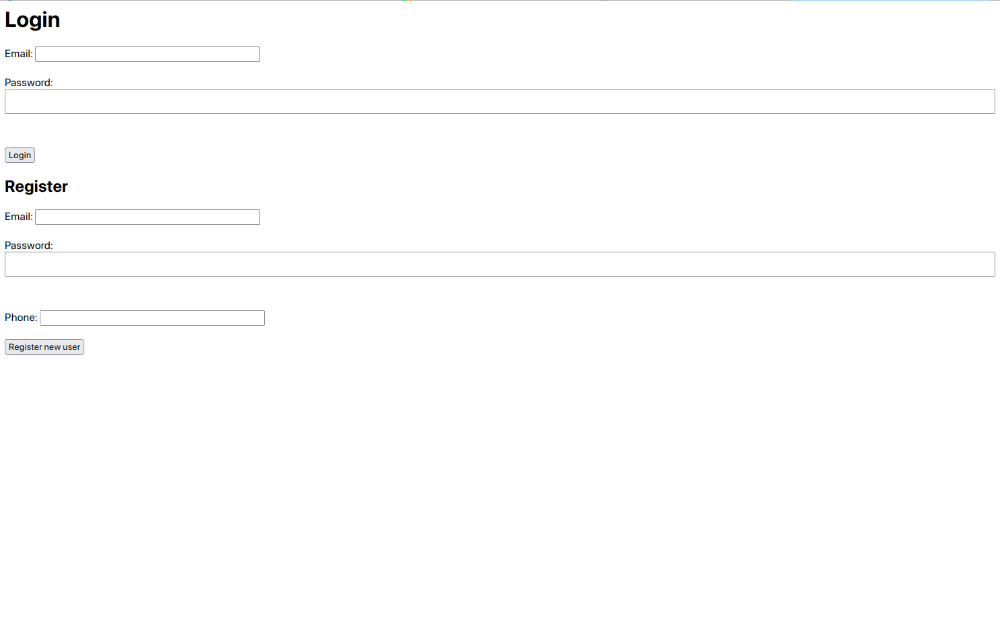
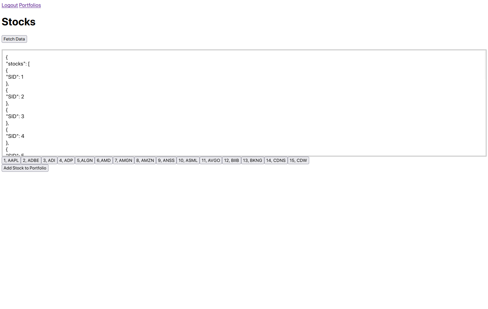
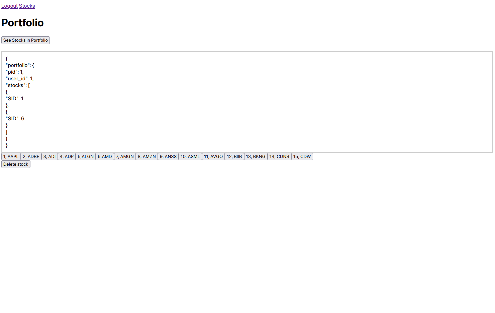
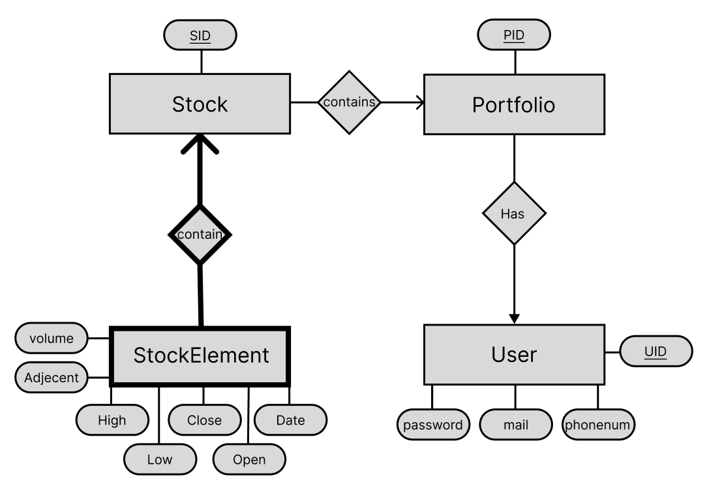

# *Stock-collection* - A Go-Gin Web Application
This is a Go-Gin web application using a Postges SQL database.
## Setup instructions
To build and run the project on you machine, follow the provided setup instructions.
This project is run preferably through Docker, but alternatives are provided.
### Using Docker
If Docker is not already installed on your system, please follow the [official install instructions](https://www.docker.com/products/docker-desktop/).
This project is run by the following two instructions, from the projects root directory, if you have docker compose installed:
```
sudo make
```
```
sudo make run
```
Or
```
sudo docker compose build
```
```
sudo docker compose up -d
```
The port at which the website is served is 80 `localhost:80/`, this port can either be found in `docker-compose.yml` or by running:
```
sudo docker compose logs db
```

### Without Docker
If you do not have Docker and/or Docker compose installed, the following instructions must be followed (Assuming postgress is already installed).
- Donwload and install Go from [the official website](https://go.dev/dl/).
    - Check that it is installed correctly by running `go version`
- Donwload and install Nginx from [the official website](http://nginx.org/en/download.html).
    - Start the Nginx service:
        - **Linux (SystemD):** `sudo systemctl start nginx`
        - **Linux (Ubuntu):** `sudo service start nginx`
        - **MacOS (If installed with Homebrew):** `brew services start nginx`
        - **MacOS:** `sudo nginx`
        - **Windows:** `start nginx`
- Install gin: `go get github.com/gin-gonic/gin`
- Install a postgres driver by the following two commands: `go get gorm.io/gorm` and `go get gorm.io/driver/postgres`
- Start the backend by the following command `go run main.go` and the application should be ready to serve on the default port on your machine.


## Application walkthrough
### Login page
- Login by filling the login form. If your user does not exit fill the Register form and login again.


### Stock viewer page
- You are met with an empty information box → Click on fetch data to populate the box with stock ID's.
- Click on a stock below the information box to see stock elements.
- Clock od *Add Stock to Portfolio* to add a stock to a portfolio.


### User portfolio page
- Shows all stocks added to the current users portfolio.
- Click on one of the corresponding stock ID's from the options below the information box to select.
- Click on *Delete stock* to remove the selected stock from the portfolio.


## ER-Diagram for the database:


## How do SQL queries come into play using an ORM?
Since Gorm has been used to interact with the database; this project uses ORM's instead of embedded SQL.
### Portfolio Controller
In our porfolio controller `SELECT` is used various places like getting a portfolio from a user ID:
```go
result := Initializers.DB.Where(&models.Portfolio{UserID: uint(UserIDUint)}).Preload("Stocks").First(&portfolio)
```
`UPDATE` is used to add stocks to portfolios:
```go
if err := Initializers.DB.Model(&portfolio).Association("Stocks").Append(&stock)
```
And finally `DELETE` is used to remove a stock from a portfolio:
```go
Initializers.DB.Model(&portfolio).Association("Stocks").Delete(&stock)
```
### Stock controller
This controller uses `SELECT` to get one or more stocks:
```go
Initializers.DB.Where(&models.Stock{SID: stock.SID}).First(&existingStock)
result := Initializers.DB.Find(&stocks)
```

### Stockelements controller
This controller uses `SELECT` to get stockelements from a stock ID:
```go
result := Initializers.DB.Where(&models.Stockelement{StockID: uint(stockIDUint)}).
    Order("Date DESC").
    Limit(100).
    Find(&stockElements)
```

### User controller
This controller uses `SELECT` various places, as an example it uses this query to check if a user already exists:
```go
Initializers.DB.Where("mail = ?", mail).First(&user).Error
```
It also uses `INSERT` various places like creating a new user:
```go
Initializers.DB.Create(&newUser)
```

## Where does regex come into play?
We utilize regex to ensure a consisten password and phone number format:
```javascript
        const passwordRegex = /^(?=.*[A-Za-z])(?=.*\d)[A-Za-z\d]{8,}$/;
        const phoneRegex = /^\d{8}$/
```
Password should have: At least one letter and one digit and is at least 8 characters long.
The phone number should be exactly 8 digits long.